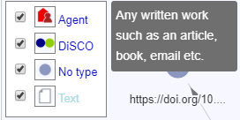

# Visualization: Configuring Types and Icons

The RMap visualization shows various RDF types represented with an appropriate icon and displayed in the legend top left. These can be configured via properties files. This guide will explain how these icons are configured:

 
## What is the RDF Type of an Object?
The icon types are determined by the `rdf:type` property in the underlying linked data. For example, if the thing being described is represented as a DOI reference, then an RDF type of journal article might be expressed as follows:

*text/turtle*
```
<https://doi.org/10.000/example> a <http://purl.org/spar/fabio/JournalArticle>
```
*application/rdf+xml*
```
<rdf:Description rdf:about="https://doi.org/10.000/example">
        <rdf:type rdf:resource="http://purl.org/spar/fabio/JournalArticle"/>
```
*application/ld+json*
```
{
   "@id": "https://doi.org/10.000/example",
   "@type": [
       "http://purl.org/spar/fabio/JournalArticle"
   ]
}
```

The type of `https://doi.org/10.000/example` is a `http://purl.org/spar/fabio/JournalArticle`. If multiple types are found and they map to different categories, the one that appears most frequently will be used for the icon, otherwise it will use the most recently referenced one.

## Configuring the Categories
The types inferred by the RDF can be grouped into icon categories. With the exception of "No type" and "Other" the categories shown in the legend are fully customizable. You can configure:

* What categories there are
* The icon that represents the category
* The description that pops up when you hover over the icon in the visualization legend
* The `rdf:type`s that should fall under each category

For "No type" and "Other" you can change how they are displayed, but not their names or what falls under them - these are currently hard coded.

There are two files that contribute to the configuration of these icons:

-   [nodetype.properties](https://github.com/rmap-project/rmap/blob/master/webapp/src/main/resources/nodetypes.properties) - configures the names of the types and the icons / color that will represent them.
-   [typemappings.properties](https://github.com/rmap-project/rmap/blob/master/webapp/src/main/resources/typemappings.properties) - lists the RDF type paths and maps them to the appropriate node type. 

These can be found in the following directory on the web sever: `/tomcat/webapps/rmap-gui/WEB-INF/classes`. 

## nodetypes.properties

The nodetypes.properties file defines the names of the type categories that will be grouped together and allows you to assign an icon for your visualization. If you inspect the nodetypes.properties file, you will see it is pre-populated with rows like this:
```
Text=\#939598|image|/includes/images/nodeicons/text.png|Any written work such as an article, book, email etc.
```
Using this example:
* The word "Text" will appear in the legend
* The color #939598 will be the color of any edges going out of that object
* "image" indicates the icon will be an image (rather than a solid colored dot or square)
* The image path for the icon is provided as the next property after "image" 
* The last property is the description that will appear when you hover over that icon in the legend.

Here is a a screenshot with the hover-over activated on the legend:



If the type name has two words, such as “Physical Object”, in the properties file any spaces should be replaced with an “_” to make e.g. “Physical_Object”. 

If you don't want to use an image icon, you can also use a solid colored "dot" or "square" as follows:
```
Physical_Object=\#C0C0C0|dot|A physical object
``` 
In this instance the color of the dot and the edges going out of it will be the color referenced as the first property.

### typemappings.properties
The typemappings.properties file uses the types configured in nodetypes.properties and indicates what RDF types should be mapped to them. You can have one or more types mapped to each category. 

To display both `dcmitype:Text` and `fabio:JournalArticle` as a nodetype “Text”, for example, you would add rows that look like this to the typemappings.properties file:
```
http\://purl.org/spar/fabio/JournalArticle=Text
http\://purl.org/dc/dcmitype/Text=Text
```

"Text" here corresponds to "Text" in the nodetypes.properties file and must be written exactly as it is there. It is also important to use the full path of the rdf:type in this file. 

### Deployment
Once the two properties files have been configured as needed, take the following steps to deploy them:

1. Take a backup copy of the new properties files plus any new icon image files and save them to a path outside of the Tomcat `/webapps/` folder. A new deployment of the `.war` file would overwrite the folders they are kept in and so any changes would need to be redone after a .war deployment. 
2. Replace the two corresponding properties files in `/tomcat/webapps/rmap-gui/WEB-INF/classes` with your new versions. 
3. Upload any new icons to the nodeicons folder: `/tomcat/webapps/rmap-gui/includes/images/nodeicons/`
4. Do a Tomcat restart in order for the new properties to be picked up by the web application. 

Your new categories should be visible.